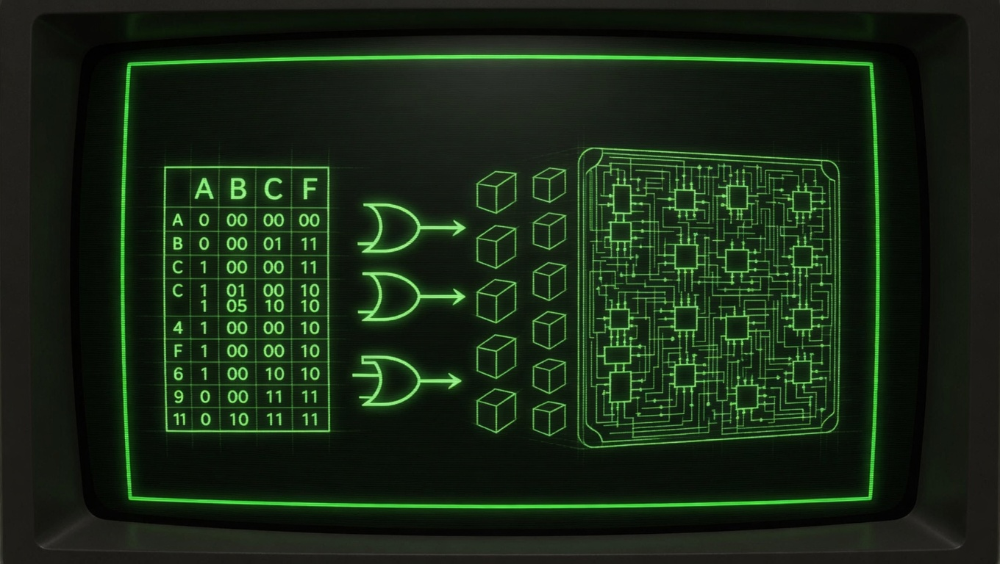

# Espresso

Modern C# rewrites of the Berkeley **Espresso-II** two-level logic minimizer,
alongside the original C reference buildable in a perfect Visual Studio Solution for easy development. 

Espresso minimizes Boolean / multi-valued logic functions expressed as PLA
(Programmable Logic Array) files — the canonical tool for two-level synthesis
in digital design.

## Repository layout

| Folder | What it is |
| --- | --- |
| `Espresso/` | Original UC Berkeley C source (**~14 kLoC C across 62 files**), with a Visual Studio project that builds `Espresso.exe` — the reference binary used by the test harness. Contains its own historical README. |
| `EspressoCS/` | First-generation, mechanical 1:1 C → C# port (**~14 kLoC C# across 53 files**, namespace `EspressoCS`). Preserves the full CLI surface of the native tool (`-D`, `-e`, `-o`, `-S`, `-selftest`, …). Fully validated against the test suite. |
| `EspressoII/` | Second-generation rewrite (**~3.8 kLoC C# across 7 files**, namespace `Espresso`). Tight, allocation-aware implementation focused on the default heuristic minimization flow. Matches — and on several PLAs **beats** — the cube counts produced by the original Berkeley `Espresso.exe`. Ships with a persistent 128-bit-keyed result cache (`MemoCache`) that can re-use prior work on similar PLAs for **up to ~30× speedups** on repeat runs. |
| `EspressoIII/` | Reserved for an in-progress third-generation rewrite. No checked-in sources yet. |
| `EspressoII.Tests/` | MSTest project. Runs every PLA in `tests/` through both the C and C# minimizers in parallel and reports per-file cube counts and timings. |
| `tests/` | PLA regression corpus (`examples/`, `pla/`, `table_ex/`, `tlex/`, plus `hard_examples/`). |




 `EspressoII` reaches parity-or-better cube counts against Berkeley's
~14 kLoC C implementation in roughly **1/3.7 the source size** — and ~1/3.7
the size of the mechanical `EspressoCS` port it was distilled from, with on average far better performance.

## Quality vs. the original Espresso

`EspressoII` is verified against the native Berkeley binary on every PLA in
`tests/` by `EspressoII.Tests`. For each file it runs both minimizers, checks
Boolean equivalence, and compares cube counts:

- On the great majority of inputs the C# port produces a cover with the **same
  number of cubes** as the original C tool.
- On a non-trivial subset it produces a **strictly smaller** cover (fewer
  product terms) — the test summary explicitly counts these as "C# wins".
- It is never allowed to produce a non-equivalent cover; `Program.VerifyCovers`
  re-validates the result against the original `(F, D)` after every run.

In other words: `EspressoII` is at least as good as `Espresso.exe` on the
checked-in corpus, and strictly better on some PLAs.

## Result caching (`MemoCache`)

`EspressoII` integrates a built-in, persistent **128-bit keyed result cache**
(`EspressoII\MemoCache.cs`) that memoizes the *outputs* of the expensive
algorithm phases. Keys are 128-bit hashes of the PLA schema (variable layout,
part sizes, binary-var mask) plus the serialized inputs of the call, so cache
entries from one PLA can be reused by any later PLA whose call happens to hash
to the same bits.

Tagged operations currently cached:

| Tag | What is memoized |
| --- | --- |
| `TagMinimize` | Whole-PLA `EspressoMinimizer.Minimize(F, D, R)` result — a complete minimized cover |
| `TagFindIrredundant` | `Irredundant.FindIrredundant` output |
| `TagExpandCover` | `Expander.ExpandCover` output |
| `TagMakeSparse` | `MakeSparse` post-processing output |
| `TagComplement` | OFF-set / generic complement results |
| `TagIsTautology` | Tautology-check decisions on cofactored sub-covers |
| `TagIsCubeCovered` | "Is this cube covered by F ∪ D?" decisions |

The cache lives at `%APPDATA%\Espresso\cache.bin` by default (override with
`ESPRESSO_CACHE_FILE`, disable for the test suite with
`ESPRESSO_TEST_NOCACHE=1`). It is loaded on `MemoCache.Init()` and flushed on
process exit, so the second time you minimize the same — or a sufficiently
similar — PLA, the heavy work is replaced by a hash lookup. In benchmark runs
this has been measured to **accelerate repeat minimizations by up to ~30×**;
fully cached re-runs of a single PLA typically complete in well under 100 ms
regardless of the original solve time.

The cache is correctness-safe because the 128-bit key is derived from a
canonical hash of the actual call inputs (schema + cubes), not just file names
— two PLAs with different bit patterns cannot share an entry.

## Build

Requires the .NET 10 SDK and (for the reference binary) MSBuild / Visual Studio
with the C++ workload.

```powershell
# C# rewrites
dotnet build Espresso.sln -c Release --nologo

# Just the fast minimizer
dotnet build EspressoII\EspressoII.csproj -c Release --nologo

# Native reference binary (produces x64\Release\Espresso.exe)
msbuild Espresso\Espresso.vcxproj /p:Configuration=Release /p:Platform=x64
```

## Run

### EspressoII (recommended)

`EspressoII` exposes a minimal CLI: read a single PLA, or stream multiple PLAs
from stdin, write the minimized cover to stdout.

```powershell
# minimize a single file
dotnet run --project EspressoII -c Release -- tests\examples\dc1

# eqntott-style algebraic output
dotnet run --project EspressoII -c Release -- -o eqntott tests\examples\dc1

# verify two PLAs are Boolean-equivalent
dotnet run --project EspressoII -c Release -- -verify a.pla b.pla

# stream many PLAs through stdin
Get-Content multi.pla | dotnet run --project EspressoII -c Release
```

### EspressoCS (full feature parity with native tool)

```powershell
dotnet run --project EspressoCS -c Release -- tests\examples\al2
dotnet run --project EspressoCS -c Release -- -o eqntott tests\examples\al2
dotnet run --project EspressoCS -c Release -- -Dverify a.pla b.pla
dotnet run --project EspressoCS -c Release -- -selftest tests
```

`-selftest <dir>` re-runs every PLA under `<dir>` and verifies output hashes
against `<dir>\hash.txt`.

## Tests & benchmarks

The MSTest project runs the native `Espresso.exe` and `EspressoII` against
every file in `tests/` and reports a side-by-side summary (cube counts +
timings). The native binary is auto-discovered at `x64\Release\Espresso.exe`.

```powershell
dotnet test EspressoII.Tests\EspressoII.Tests.csproj -c Release
```

The harness installs a persistent on-disk result cache at
`bin\…\espresso_test_cache.bin` so re-runs are fast. Override or disable it
with:

```powershell
$env:ESPRESSO_CACHE_FILE = "C:\path\to\cache.bin"   # custom location
$env:ESPRESSO_TEST_NOCACHE = "1"                    # disable
```

`PerformanceTests.MinimizeAll` runs the whole corpus through `EspressoII` on
8 threads and prints total time and cube count.

## PLA file format (quick reference)

```text
.i 4               # number of inputs
.o 3               # number of outputs
.ilb Q1 Q0 D N    # input labels  (optional)
.ob T1 T0 OPEN    # output labels (optional)
0011 ---           # input bits | output bits
0101 110           #   '0' / '1' literals, '-' = don't care
...
.e                 # end of file
```

After minimization the cover is emitted in the same format with a `.p N` line
giving the number of product terms.

## Algorithm reference

The full algorithmic walkthrough — EXPAND / REDUCE / IRREDUNDANT / ESSENTIAL /
LAST_GASP / MAKE_SPARSE, tautology, complement, set-cover — is appended below
in *The Espresso Algorithm — Expert-Level Implementation Guide*. Additional
notes live in `SAMPLE\functions.md` and `SAMPLE\optimization_findings.md`.

## License

The original Espresso source under `Espresso/` is distributed under the UC
Berkeley license shipped in `Espresso\LICENSE`. The C# rewrites in this
repository follow the same terms.


---

# The Espresso Algorithm — Expert-Level Implementation Guide

This document explains the Espresso-II two-level logic minimization algorithm as implemented in this codebase. It bridges the gap between the dense C# implementation and the underlying mathematical theory, providing the algorithmic *why* behind every code construct.

## Table of Contents

1. [Problem Statement](#1-problem-statement)
2. [Foundational Concepts](#2-foundational-concepts)
3. [Data Structures and Encoding](#3-data-structures-and-encoding)
4. [The Main Loop](#4-the-main-loop)
5. [EXPAND — Cube Expansion to Prime Implicants](#5-expand--cube-expansion-to-prime-implicants)
6. [REDUCE — Cube Shrinking for Reshaping](#6-reduce--cube-shrinking-for-reshaping)
7. [IRREDUNDANT — Minimum Cover Extraction](#7-irredundant--minimum-cover-extraction)
8. [ESSENTIAL — Extracting Absolutely Necessary Primes](#8-essential--extracting-absolutely-necessary-primes)
9. [TAUTOLOGY — Universal Function Detection](#9-tautology--universal-function-detection)
10. [COMPLEMENT — Computing the OFF-set](#10-complement--computing-the-off-set)
11. [LAST_GASP — Escape from Local Minima](#11-last_gasp--escape-from-local-minima)
12. [MAKE_SPARSE — Post-Optimization for Multi-Valued Outputs](#12-make_sparse--post-optimization-for-multi-valued-outputs)
13. [Minimum Cover Problem (Set Covering)](#13-minimum-cover-problem-set-covering)
14. [Unate Complement](#14-unate-complement)
15. [Convergence and Correctness](#15-convergence-and-correctness)
16. [Code Map](#16-code-map)

---

## 1. Problem Statement

Given a Boolean (or multi-valued) function specified as three disjoint sets of product terms:

| Set | Name | Meaning |
|-----|------|---------|
| **F** | ON-set | Points where the function must be 1 |
| **D** | DC-set | Don't-care points (may be either 0 or 1) |
| **R** | OFF-set | Points where the function must be 0 |

Find a cover **F'** such that:
- **F'** covers all of **F** (correctness)
- **F'** ∩ **R** = ∅ (no OFF-set intersection)
- |**F'**| is minimized (fewest product terms, then fewest literals)

This is NP-hard in general. Espresso uses heuristic iterative improvement to find a near-optimal solution in polynomial time per iteration.

### Why Not Quine-McCluskey?

Quine-McCluskey enumerates *all* prime implicants, then solves a set cover problem to pick the minimum subset. The number of primes can be exponential (up to 3^n / n for n variables). Espresso avoids this by never materializing all primes simultaneously — it only maintains a working cover and improves it incrementally.

---

## 2. Foundational Concepts

### 2.1 Cubes and Product Terms

A **cube** (product term) is an AND of literals. In positional notation, each variable has a set of allowed values. For a binary variable x_i, the encoding is:

| Literal | Bit pair |
|---------|----------|
| x_i     | `10`     |
| x̄_i    | `01`     |
| don't-care | `11`  |
| empty   | `00`     |

A cube represents the intersection of half-spaces. Two bits `00` means the variable's constraint is unsatisfiable — the cube is empty.

### 2.2 Distance Between Cubes

The **distance** between cubes a and b is the number of variables where a and b are *disjoint* (their intersection on that variable is empty):

```
distance(a, b) = |{ v : a_v ∩ b_v = ∅ }|
```

Key properties:
- **Distance 0**: The cubes overlap — their AND is non-empty
- **Distance 1**: The cubes are adjacent — their consensus exists
- **Distance ≥ 2**: The cubes are separated — no useful interaction for expansion

### 2.3 Cofactoring

The **cofactor** of a cover F with respect to a cube c, written F_c, restricts the Boolean space to the portion covered by c:

```
F_c = { (f_i ∩ c) : f_i ∈ F, distance(f_i, c) = 0 }
```

The cofactored cube expands each surviving term to fill the restricted space. In implementation, the cofactor is tracked via a "cof" bitvector that records which parts are *forced* (already decided by the restriction). Any part present in cof is logically "don't-care" within the cofactored space.

### 2.4 Tautology

A cover is a **tautology** if it covers the entire Boolean space (every minterm is covered by at least one cube). Tautology checking is the fundamental decision procedure — it answers "is this point covered?" via cofactoring: cube c is covered by cover F iff F_c is a tautology.

### 2.5 Prime Implicant

A cube p is a **prime implicant** of function f if:
1. p ⊆ f ∪ d (p doesn't cover any OFF-set point)
2. No proper supercube of p satisfies condition 1

Expanding a cube to a prime means making it as large as possible without hitting the OFF-set.

### 2.6 The ON-set / DC-set / OFF-set Partition

The algorithm works with three covers that partition the Boolean space:
- **F** (ON-set): Function output = 1
- **D** (DC-set): Function output = don't care
- **R** (OFF-set): Function output = 0

The OFF-set R is typically computed as the complement of F ∪ D.

---

## 3. Data Structures and Encoding

### 3.1 BitVector — The Atomic Set

**File**: `BitSet.cs:27-59`

```
Memory layout of a single cube (BitVector):
┌──────────┬──────────┬──────────┬─────┬──────────┐
│ meta word│ data[0]  │ data[1]  │ ... │ data[N-1]│
└──────────┴──────────┴──────────┴─────┴──────────┘
     ↑           ↑
     │           └── _dataOffset points here
     └── flags (bits 0-7) + sort key (bits 16-31)
```

A `BitVector` is a lightweight struct (not a class — no heap allocation for the view itself) containing:
- `uint[] _data` — backing array (shared across many cubes)
- `int _dataOffset` — index of first data word
- `int _wordCount` — number of 32-bit data words

The metadata word at `_data[_dataOffset - 1]` packs:
- **Bits 0-7**: `CubeFlags` enum (Prime, NonEssen, Active, Redund, Covered, RelEssen)
- **Bits 16-31**: Sort key (used transiently during sorting operations)

The `.AsSpan()` method returns `Span<uint>` over the data words only — metadata is accessed separately via `.Meta`.

### 3.2 BitVectorFamily — The Cube Matrix

**File**: `BitSet.cs` (BitVectorFamily class)

A `BitVectorFamily` stores multiple cubes in a single contiguous `uint[]` array with fixed stride:

```
stride = 1 (meta) + WordCount(size) (data)

Data layout:
┌─────────────────┬─────────────────┬─────┬─────────────────┐
│  cube 0         │  cube 1         │ ... │  cube N-1       │
│ [meta][d0]...[dW]│ [meta][d0]...[dW]│     │ [meta][d0]...[dW]│
└─────────────────┴─────────────────┴─────┴─────────────────┘
```

Key property: `GetSet(i)` returns a `BitVector` view into position `i * stride`, enabling zero-copy access. The backing array is shared — **modifying a span modifies the family in-place**.

`ActiveCount` tracks how many cubes have the `Active` flag set, enabling O(1) "are there active cubes?" checks without scanning.

### 3.3 CubeList — The Cofactored Cover

**File**: `CubeModel.cs` (Cofactor.BuildCubeList)

```csharp
public readonly struct CubeList
{
    public BitVector Cof;       // The cofactor (restriction) applied
    public BitVector[] Cubes;   // Array of cube references
    public int Count;
}
```

A `CubeList` is a *view* — it holds references to cubes that may live in different `BitVectorFamily` instances. The `Cof` bitvector tracks accumulated cofactoring: bits set in `Cof` represent parts of the Boolean space that have been "used up" by restrictions.

When cofactoring, a new `CubeList` is created with:
- `Cof` updated: `new_cof = old_cof | ~c` (parts not in the splitting cube become forced)
- `Cubes` filtered: only cubes at distance-0 from the splitting cube survive

### 3.4 CubeData — The Problem Descriptor

**File**: `CubeModel.cs:31-68`

```csharp
public sealed record CubeData
{
    public int Size;           // Total bits across all variables
    public int NumVars;        // Total variable count
    public int NumBinaryVars;  // Binary variable count (2 bits each)
    public int[] FirstPart;    // FirstPart[v] = bit index of variable v's first part
    public int[] LastPart;     // LastPart[v] = bit index of variable v's last part
    public int[] PartSize;     // PartSize[v] = number of parts for variable v
    public BitVector[] VarMask; // VarMask[v] = bitmask covering all of variable v's parts
    public BitVector[] Temp;    // Scratch buffers for recursive operations
    public BitVector FullSet;   // All bits set (the universal cube)
    public BitVector EmptySet;  // All bits clear
    public uint InMask;         // Disjoint mask for last word of binary vars
    public int InWord;          // Word index of last binary variable
}
```

**Variable layout in the bit vector**:

For a problem with 3 binary inputs (a, b, c) and 2 outputs (f0, f1):
```
Bit positions:  0  1  2  3  4  5  6  7  8
               [a₀ a₁][b₀ b₁][c₀ c₁][f₀ f₁ ...]
                var 0   var 1   var 2   var 3 (output)
```

Binary variables always use exactly 2 bits. Multi-valued variables use `PartSize[v]` bits — each bit represents one value in the variable's domain.

### 3.5 Binary Disjoint Detection — The Paired-Bit Trick

**File**: `CubeModel.cs:295-309` (CountBinaryDisjoint)

The most performance-critical operation in Espresso is distance computation. For binary variables encoded as bit pairs, disjointness is detected with a single-word trick:

```csharp
uint x = a[w] & b[w];          // Intersection
x = ~(x | (x >> 1)) & Disjoint; // Detect empty pairs
// Disjoint = 0x55555555 = alternating 01 bits
```

**How it works**:
1. `a[w] & b[w]` computes the intersection of each bit pair
2. For a non-disjoint pair (e.g., `10 & 11 = 10`), at least one bit is set
3. `x | (x >> 1)` propagates any set bit rightward within each pair: if either bit was set, the low bit of the pair becomes 1
4. `~(...)` inverts: pairs that had any intersection → 0, empty pairs → 1 (at least in low bit)
5. `& Disjoint` masks to only the low bit of each pair (the "indicator" bits)
6. `PopCount(result)` counts the number of disjoint binary variables in this word

This processes 16 binary variables per 32-bit word in ~5 instructions — the key to Espresso's speed.

### 3.6 SplitStack — Reusable Recursion Scratch Space

**File**: `BitSet.cs` (SplitStack)

Recursive algorithms (tautology, containment, complement) need temporary cube pairs at each recursion depth for splitting. Rather than allocating on each recursive call, a `SplitStack` pre-allocates all levels:

```csharp
stack.GetPair(depth, out BitVector cl, out BitVector cr);
```

The maximum depth equals `cube.Size` (not `NumVars`) because multi-valued variable splits don't eliminate the variable in one step — each split only halves the active parts.

---

## 4. The Main Loop

**File**: `Minimizer.cs:8-49` — `EspressoMinimizer.Minimize`

```
Input: F (ON-set), D (DC-set), R (OFF-set)

1. OPTIONAL: Unwrap onset for multi-valued outputs
2. EXPAND(F, R)           → make all cubes prime
3. IRREDUNDANT(F, D)      → remove redundant primes
4. ESSENTIAL(F, D)        → extract & set aside essential primes (→ E)

5. Inner loop (REDUCE-EXPAND-IRREDUNDANT):
   repeat:
       REDUCE(F, D)       → shrink cubes to create overlap potential
       EXPAND(F, R)       → re-expand (hopefully differently)
       IRREDUNDANT(F, D)  → clean up
   until cube count stops decreasing

6. Outer loop (LAST_GASP):
   repeat:
       LAST_GASP(F, D, R) → attempt to merge/improve reduced cubes
   until no improvement in cube count or total literal cost

7. F = F ∪ E             → restore essential primes
8. MAKE_SPARSE(F, D, R)  → remove unnecessary output parts

9. If result is worse than input, retry without onset unwrapping
```

### 4.1 Onset Unwrapping

**Lines 16-19**: For multi-output functions, a single cube covering outputs {f0, f1} might be better split into separate cubes for each output. The condition checks:
- The output variable has more than 1 part
- The current output cost isn't already minimal (not all cubes cover all outputs)
- The expanded size won't be huge (< 5000 cubes)

`ExpandMultiValued` unravels the output variable: each input cube is duplicated once per output part it covers, with only that single output part retained.

### 4.2 Convergence Strategy

The double-loop structure addresses a fundamental limitation of greedy algorithms:

**Inner loop**: REDUCE-EXPAND-IRREDUNDANT is monotonically non-increasing in cube count because:
- REDUCE never increases cube count (it only shrinks or eliminates cubes)
- EXPAND never increases cube count (it modifies cubes in place)
- IRREDUNDANT can only decrease cube count

The inner loop terminates when a fixed point in cube count is reached.

**Outer loop**: LAST_GASP can escape plateaus by examining pairs of cubes and finding non-obvious merges. It continues until neither cube count nor total literal cost improves.

### 4.3 Safety Net

**Lines 42-47**: If the final result has *more* cubes than the input, the algorithm retries without onset unwrapping. This guards against pathological cases where unwrapping increases cover size.

---

## 5. EXPAND — Cube Expansion to Prime Implicants

**File**: `Minimizer.cs:192-431` — `Expander` class

### 5.1 Overview

EXPAND takes each non-prime cube in F and grows it as large as possible without intersecting the OFF-set R. The result: every cube becomes a prime implicant.

The key insight is that expansion is a *greedy set cover* problem in the dual space.

### 5.2 The Blocking Matrix Formulation

For a cube c being expanded against OFF-set R:

**RAISE** = the set of parts currently "raised" (set to 1) in the expanding cube. Initially, RAISE = c.

**FREESET** = parts that can still be changed. Initially, FREESET = FullSet \ RAISE.

**Blocking Matrix (BB)**: For each cube r_i in R that is at distance ≤ 1 from RAISE ∪ FREESET, compute the "lowering row" — the parts in r_i that are disjoint from RAISE. To avoid intersecting r_i, at least one of these parts must remain lowered (i.e., NOT raised).

**Covering Matrix (CC)**: The cubes of the ON-set F that would be covered by the expanded cube. Used to track which ON-set cubes become redundant.

### 5.3 Algorithm Steps (ExpandOneCube, lines 257-304)

```
1. Set RAISE = c, FREESET = Full \ c
2. If INIT_LOWER is non-empty (sparse mode), remove those parts from FREESET
3. ESSEN_PARTS: For each OFF-set cube at distance-1 from RAISE,
   the single disjoint part must be lowered → remove from FREESET
4. Compute OVEREXPANDED_CUBE = RAISE ∪ FREESET (maximum possible expansion)
5. Feasibly covered: mark ON-set cubes that could become redundant
6. Greedy: while covering matrix has active rows:
   - Pick the part in FREESET with highest frequency in CC
   - RAISE it (add to RAISE, remove from FREESET)
   - Re-run ESSEN_PARTS (distance-1 blockers may have become essential)
7. MINCOV: while blocking matrix has active rows:
   - Solve minimum cover to find best remaining parts to raise
8. Final: RAISE = RAISE ∪ FREESET (anything not forced down is raised)
```

### 5.4 Essential Parts Detection (DetermineEssentialParts, lines 308-336)

This is the core pruning step. For each active blocker in BB:
1. Compute distance from RAISE to the blocker
2. If distance > 1: the blocker is already blocked by multiple variables — skip
3. If distance = 1: exactly one variable is disjoint. The parts of that variable in the blocker become **essential lowering parts** — they *must* remain lowered. Call `FindDisjointParts` to identify them and remove from FREESET.
4. If distance = 0: **error** — the cube intersects the OFF-set (shouldn't happen)

### 5.5 The Mincov Step (lines 381-430)

After the greedy covering phase, remaining blockers need resolution. For each active blocker at distance-1:
1. Collect the disjoint parts (the "lowering row") into a matrix B
2. If the matrix is small enough (< 500 expanded rows), solve it exactly via `MinimumCoverSolver.SolveFromFamily`
3. Otherwise, fall back to heuristic: raise the most frequent free part and re-run essential parts

The mincov solution identifies which FREESET parts to raise to block all remaining OFF-set cubes with minimum cost.

### 5.6 Processing Order

**Line 199**: Cubes are sorted by coverage count (ascending) before expansion. Cubes that overlap least with others are expanded first — they have the most freedom and are least likely to accidentally cover (and thus eliminate) other useful cubes.

### 5.7 Feasible Coverage (SelectFeasiblyCovered, IsFeasiblyCovered)

During expansion of cube c, if another ON-set cube c' is a subset of OVEREXPANDED_CUBE (the maximum expansion of c), then c' might become redundant. Feasible coverage tracks this: if c' would be fully covered by the expansion, it gets the `Covered` flag and is removed from the final output. This is how EXPAND implicitly reduces the number of cubes.

---

## 6. REDUCE — Cube Shrinking for Reshaping

**File**: `Minimizer.cs:432-557` — `Reducer` class

### 6.1 Purpose

REDUCE does the opposite of EXPAND: it shrinks each cube to the smallest cube that is still covered by the rest of the cover. This "reshaping" is crucial because:

1. After EXPAND, cubes are maximally expanded — they're stuck in a particular configuration
2. REDUCE destabilizes this configuration by making cubes smaller
3. The subsequent EXPAND can then find a *different* set of prime implicants

Without REDUCE, EXPAND-IRREDUNDANT would converge in one iteration to a potentially suboptimal cover.

### 6.2 Algorithm (ReduceCover, lines 436-461)

```
1. Sort F (alternating between SortForReduction and SortByCoverage on each call)
2. For each cube p in F:
   a. Compute FD = F ∪ D (the cover without p plus don't-cares)
   b. Cofactor FD with respect to p: (F ∪ D)_p
   c. Find the CONTAINMENT CUBE of (F ∪ D)_p
   d. Intersect containment cube with p → reduced cube
   e. If reduced ≠ p: replace p with reduced cube, clear Prime flag
   f. If reduced = empty: mark cube as inactive (removable)
3. Compact: remove inactive cubes
```

### 6.3 The Containment Cube (ContainmentCube, lines 468-482)

The containment cube of a cover T is the **largest single cube contained in T**. It's the dual of tautology: while tautology asks "does T cover everything?", containment asks "what single cube is guaranteed to be covered by T?"

It's computed recursively by Shannon decomposition:

```
containment(T) = containment(T_left) ∩ cl ∪ containment(T_right) ∩ cr
```

Where cl and cr are the splitting cubes for the best variable.

### 6.4 Special Cases (ContainmentCubeSpecialCases, lines 503-557)

1. **T is empty**: Return FullSet (the entire space is "contained" vacuously — anything reduces to nothing)
2. **Some cube covers the full space under cofactor**: Return EmptySet (the cube can be reduced to nothing since it's fully redundant)
3. **All variables are unate or T has ≤ 1 cube**: Compute directly using `SingleCubeContainment`
4. **Ceiling doesn't cover full space**: Recurse on the non-full portion
5. **Only 1 active variable**: Return EmptySet
6. **Poorly balanced split**: Try `PartitionCubeList` to decompose into independent sub-problems

### 6.5 SingleCubeContainment (lines 491-502)

When the cover is essentially a single cube (or all unate), the containment is computed by XORing with the single active variable's mask — this identifies the parts that could be removed.

### 6.6 Sort Alternation

**Lines 434, 438-439**: The sort order alternates between two strategies on each call to `ReduceCover`:
- **SortForReduction**: Distance from the largest cube (expand-similar cubes first)
- **SortByCoverage**: By total coverage overlap (descending — most-covered cubes first)

This alternation prevents the algorithm from getting stuck in cycles where the same sort order produces the same reduction every time.

---

## 7. IRREDUNDANT — Minimum Cover Extraction

**File**: `Minimizer.cs:559-735` — `Irredundant` class

### 7.1 Overview

After EXPAND produces a set of prime implicants, many are redundant (their minterms are all covered by other primes). IRREDUNDANT finds a minimum-cost irredundant subset.

### 7.2 Three-Way Partition (SplitCoverByRedundancy, lines 594-617)

The cubes of F are classified into three groups:

| Group | Name | Definition |
|-------|------|------------|
| **E** | Relatively essential | Removing this cube leaves some minterm uncovered |
| **R** | Redundant | All minterms covered by other cubes in F ∪ D |
| **Rp** | Partially redundant | Redundant in F but not in E ∪ D alone |

Classification uses tautology checking:
1. For each cube p in F, check if (F \ {p} ∪ D)_p is a tautology
   - Yes → p is redundant (goes to R)
   - No → p is relatively essential (goes to E)
2. For each cube in R, check if (E ∪ D)_p is a tautology
   - Yes → p stays redundant (discard)
   - No → p is partially redundant (goes to Rp)

### 7.3 Cover Table Construction (DeriveCoverTable, lines 618-633)

The partially redundant cubes Rp are the candidates. We need to find the minimum subset of Rp that, together with E and D, covers all of F.

`DeriveCoverTable` builds a sparse matrix where:
- **Rows**: represent minterms (or minterm-regions) not covered by E ∪ D alone
- **Columns**: represent Rp cubes, with column j corresponding to Rp cube j

This matrix is built using `FunctionalTautology`: for each Rp cube, cofactor the cover (with that cube marked as redundant) and find the non-tautological leaves. At each such leaf, a row is created connecting the responsible Rp cubes.

### 7.4 FunctionalTautology (lines 678-717)

This is a variant of tautology that, instead of returning true/false, records *which redundant cubes* are responsible for covering each non-tautological region:

```
FunctionalTautology(T, table, rpCurrent):
  if some non-redundant cube covers full space: return TRUE
  if all unate:
    for each covering redundant cube: Insert(table, newRow, rpCube)
    Insert(table, newRow, rpCurrent)
    return TRUE
  else:
    split on best variable
    recurse on both halves
```

The resulting sparse matrix feeds into the minimum cover solver.

### 7.5 FilterUnate — Pruning Unate Variables (lines 718-735)

Before splitting on a binate variable, any cubes that don't contribute to the unate variables are filtered out. This reduces the recursion tree size. A cube survives filtering only if, together with the cofactor, it covers all unate variable masks.

---

## 8. ESSENTIAL — Extracting Absolutely Necessary Primes

**File**: `Minimizer.cs:737-806` — `Essential` class

### 8.1 Concept

An **essential prime** is a prime implicant that covers at least one minterm not covered by any other prime. These must appear in every minimum cover.

### 8.2 Algorithm (FindEssentials, lines 739-756)

```
For each cube p in F:
  if p is relatively essential (from IRREDUNDANT) and not marked NonEssen:
    Compute CubeConsensus(F ∪ D, p)  → all cubes derivable from F ∪ D by consensus with p
    Build a cover from these consensus cubes plus D
    Check if p is covered by this derived cover (IsCubeCovered)
    If NOT covered → p is essential (no combination of other cubes can replace it)
```

Essential cubes are moved to set E and removed from F. D is augmented with E (since essentials are guaranteed to be in the output, they act as don't-cares for remaining optimization).

### 8.3 CubeConsensus (lines 759-780)

The consensus of two cubes a and b is defined when distance(a, b) = 1:
```
consensus(a, b) = (a_v ∪ b_v) for the disjoint variable v, (a_v ∩ b_v) for all others
```

`CubeConsensus(T, c)` computes the consensus of every cube in T with cube c:
- Distance 0: Generates cubes via `CubeConsensusDist0` (handles multi-valued overlap)
- Distance 1: Standard consensus via `Consensus` function

This effectively generates all cubes that can "partially replace" c's coverage.

---

## 9. TAUTOLOGY — Universal Function Detection

**File**: `Minimizer.cs:583-676` — `Irredundant.IsTautology`

### 9.1 Role

Tautology is the decision oracle for the entire algorithm. It answers: "Does cover T cover the entire Boolean space?" This is equivalent to asking whether the complement of T is empty.

### 9.2 Recursive Structure

```
IsTautology(T):
  result = TautologySpecialCases(T)
  if result ≠ MAYBE: return result
  Pick best splitting variable v
  Build splitting cubes cl, cr for variable v
  return IsTautology(T_cl) AND IsTautology(T_cr)
```

Shannon decomposition: the function is a tautology iff both cofactors (positive and negative) are tautologies.

### 9.3 Special Cases (TautologySpecialCases, lines 634-677)

The special cases avoid unnecessary recursion. They are checked in a **loop** (not just once) because filtering may create new special cases:

1. **Row of all ones**: If any cube, ORed with the cofactor, equals FullSet → that cube covers everything → TRUE

2. **Ceiling check**: Compute the OR of all cubes plus cofactor. If this doesn't equal FullSet, some parts are uncoverable → FALSE

3. **All unate**: If every active variable is unate (has parts with zeros in only one direction), the function cannot be a tautology of a non-trivial cover → FALSE. A unate cover is a tautology only if it's trivially so (some cube covers everything).

4. **Single active variable**: If only one variable remains non-trivial, the ceiling check already confirmed coverage → TRUE

5. **Unate filtering**: If some variables are unate but others aren't, filter out cubes that don't affect the unate variables, then re-check. This is done via `FilterUnate` which removes cubes that don't cover the unate variable ceiling.

6. **Weak partitioning**: If the best variable split would be very unbalanced (too few zeros), try `PartitionCubeList` to decompose into independent sub-problems. If either partition is a tautology, the whole cover is a tautology.

### 9.4 Variable Selection for Splitting

The splitting variable is chosen by `AnalyzeSplitVariable` (CubeModel.cs:160-168):

Priority:
1. **Most active parts** — a variable with more active parts (parts that appear as 0 in some cube) provides better discrimination
2. **Most total zeros** — among equally active variables, prefer the one with more zero-entries
3. **Most balanced** — among ties, prefer the variable whose maximum single-part zero count is smallest (producing more balanced splits)

### 9.5 Building Split Cubes (BuildSplitCubes, CubeModel.cs:246-263)

For the chosen variable v with active parts p_1, ..., p_k:
- **cl** gets the first ⌊k/2⌋ active parts
- **cr** gets the remaining active parts
- Both get all parts from all other variables (FullSet minus VarMask[v])

This creates a balanced binary partition of variable v's active space.

---

## 10. COMPLEMENT — Computing the OFF-set

**File**: `Minimizer.cs:884-1071` — `Complement` class

### 10.1 Purpose

Given the ON-set F and DC-set D, the OFF-set R = complement(F ∪ D). The complement of a cover is the set of all minterms not covered by any cube in the cover.

### 10.2 Recursive Structure (ComputeComplement, lines 889-900)

```
complement(T):
  if special_case(T, Tbar): return Tbar
  Split on best variable v into cl, cr
  Tl = complement(T_cl)   // complement of left cofactor
  Tr = complement(T_cr)   // complement of right cofactor
  return MergeComplements(Tl, Tr, cl, cr)
```

### 10.3 Special Cases (ComplementSpecialCases, lines 901-951)

1. **Empty cover** (T.Count == 0): Complement is {FullSet} (the whole space)
2. **Single cube**: Use `ComplementSingleCube` — DeMorgan's law produces one output cube per variable with non-full parts
3. **Full coverage cube exists**: Complement is empty
4. **Ceiling incomplete**: Complement the non-covered region separately, then append to the recursion on the covered portion
5. **Single active variable**: Complement is empty (ceiling already verified full coverage)
6. **All unate**: Delegate to `UnateComplement.Compute` (exact polynomial-time algorithm for unate functions)

### 10.4 ComplementSingleCube (lines 1007-1019)

For a single cube p, its complement is the union of "anti-cubes", one per variable:

```
complement({p}) = ∪_v { cube with variable v set to (full_v \ p_v), all others full }
```

This is DeMorgan's law applied to the product term: NOT(a AND b AND c) = (NOT a) OR (NOT b) OR (NOT c).

### 10.5 MergeComplements (lines 953-989)

After computing Tl = complement of left cofactor and Tr = complement of right cofactor:

1. **Restrict**: AND each cube in Tl with cl, each cube in Tr with cr (project back to the original space)
2. **Distance-1 merge**: Sort both lists, then scan for pairs where cubes in L and R differ only in the split variable → merge them (OR the L cube with the R cube, mark the R cube inactive)
3. **Lifting**: Try to expand complement cubes across the split boundary:
   - `UseComplLift` (default): For each cube a in Tl, check if the lifted version (a with variable v set to full) is contained in some cube of Tr. If so, apply the lift.
   - `UseComplLiftOnset` (when product would be large): Check if the lifted cube doesn't intersect the onset T — if safe, apply the lift.
4. **Collect**: Gather all active cubes from both sides into the result.

### 10.6 Lifting Strategy Selection (line 899)

```csharp
Tr.Count * Tl.Count > (Tr.Count + Tl.Count) * T.Count
    ? UseComplLiftOnset : UseComplLift
```

If the cross-product of the two complements would be large relative to a linear scan, use onset-based lifting (which checks against T directly) instead of cross-checking L against R.

---

## 11. LAST_GASP — Escape from Local Minima

**File**: `Minimizer.cs:808-882` — `GaspOptimizer` class

### 11.1 Purpose

When REDUCE-EXPAND-IRREDUNDANT reaches a fixed point, LAST_GASP attempts to find improvements by examining pairs of cubes. It combines ideas from REDUCE and EXPAND in a more aggressive way.

### 11.2 Algorithm (LastGasp, lines 810-836)

```
1. REDUCE each cube in F → G (reduced versions)
2. For each reduced cube G[i]:
   a. Deactivate G[i] itself and all prime cubes in G
   b. For each remaining active cube G[j]:
      - If G[j] ⊆ G[i] (RAISE), or G[j] is feasibly covered by R with RAISE=G[i]:
        * REDUCE G[j] against F with G[i] in place
        * If the reduced G[j] is feasibly covered: OR it with RAISE → add to G1
3. Remove duplicates from G1
4. EXPAND G1 against R
5. F = IRREDUNDANT(F ∪ G1, D)
6. Recalculate cost
```

### 11.3 Key Insight

LAST_GASP finds cubes that would be useful if some other cube were reduced differently. By trying each cube as a "seed" and looking for cubes that become redundant under that seed's expansion, it discovers merging opportunities invisible to single-cube REDUCE.

### 11.4 Temporary Mutation (lines 853-881)

The algorithm temporarily replaces the original cube in Foriginal with the reduced version to build a proper cofactor, then restores it. The `ArrayPool` rental for `saved` ensures the original data is preserved.

---

## 12. MAKE_SPARSE — Post-Optimization for Multi-Valued Outputs

**File**: `Minimizer.cs:51-187` — `SparseReducer` class

### 12.1 Purpose

After the main Espresso loop completes, `MakeSparse` removes unnecessary output bits from cubes. For multi-output functions, a cube like `a·b → {f0, f1}` might be reducible to `a·b → {f0}` if f1 is covered elsewhere.

### 12.2 Algorithm (MakeSparse, lines 53-68)

```
repeat:
  MvReduce(F, D)       → remove individual output parts
  if no cost change: break
  EXPAND(F, R, sparse=1)  → re-expand only non-sparse variables
  if no cost change: break
```

### 12.3 MvReduce (lines 69-131)

For each sparse (multi-valued) variable, for each part of that variable:
1. Build F1: cubes containing this part, restricted to *only* this part of the variable
2. Build D1: similarly restricted don't-care cubes
3. Run `MarkIrredundant(F1, D1)` to find which restricted cubes are redundant
4. If a restricted cube is redundant → remove that part from the original cube
5. After processing all parts, remove any cube that lost all parts of some variable (empty cube)

---

## 13. Minimum Cover Problem (Set Covering)

**File**: `MinimumCover.cs:125-558` — `MinimumCoverSolver`, `CoverSolution`, `Dominance`

### 13.1 Overview

The minimum cover problem appears in two contexts:
1. **IRREDUNDANT**: Selecting the minimum subset of partially redundant cubes
2. **EXPAND/Mincov**: Finding optimal parts to raise in the blocking matrix

Both reduce to: given a matrix M where rows are requirements and columns are options, find the minimum set of columns that covers all rows.

### 13.2 Solver Structure (SolveRecursive, lines 160-182)

```
SolveRecursive(A, select, lb, bound):
  1. SelectEssentialColumns(A, select)      — columns that are the only choice for some row
  2. if cost ≥ bound: return null (pruned)
  3. TryGimpelReduction(A)                  — 2x2 structural reduction
  4. FindMaximalIndependentSet(A)           — lower bound computation
  5. if lb ≥ bound: return null (pruned)
  6. TryBlockPartition(A)                   — decompose into independent sub-problems
  7. Pick branching column (heuristic weighted selection)
  8. Recurse with that column selected
```

### 13.3 Essential Column Selection (lines 207-230)

Iteratively:
1. Apply **column dominance** (remove dominated columns — a column dominated by another can be dropped since the dominator covers at least as many rows)
2. Find **essential columns** (rows with only one remaining column — that column must be selected)
3. Apply **row dominance** (remove dominated rows — if row A's columns are a subset of row B's, row A is harder to satisfy, so row B can be dropped)

Repeat until no more changes.

### 13.4 Gimpel Reduction (TryGimpelReduction, lines 237-276)

When a row has exactly 2 columns and one of those columns covers exactly 2 rows, a structural reduction is possible. This is equivalent to variable elimination in SAT solving — the two rows and two columns can be collapsed into a simpler structure.

The reduction:
1. Find a row with columns {c1, c2} where c1 covers only 2 rows
2. Save the secondary row's other columns
3. Merge: add saved columns to all rows that c2 covers
4. Delete both columns and both rows
5. Recurse on the smaller matrix
6. Reconstruct: if the saved columns overlap the solution, choose c2; otherwise choose c1

### 13.5 Independent Set Lower Bound (lines 277-329)

A **maximal independent set** of rows provides a lower bound on the cover size: if no two rows share a column, each needs its own column. The algorithm greedily picks the row with the fewest intersecting rows, then removes all intersecting rows.

`BuildIntersectionMatrix` (lines 300-329) constructs a graph where rows are connected if they share any column — the independent set is found in this graph.

### 13.6 Block Partitioning (Dominance.TryBlockPartition, lines 599-631)

If the matrix decomposes into independent blocks (connected components of the row-column bipartite graph), each block can be solved independently. The BFS `Visit` function checks if the first row's component covers all rows — if not, the matrix is partitioned into L and R.

### 13.7 Branch Column Selection (SelectBranchColumn, lines 183-206)

Among columns appearing in the independent set's rows, select the column maximizing:
```
w(col) = Σ_{row ∈ col} 1 / (|row.cols| - 1)
```

This heuristic prefers columns that cover "hard" rows (rows with few remaining options).

---

## 14. Unate Complement

**File**: `MinimumCover.cs:331-538` — `UnateComplement` class

### 14.1 When It's Used

When `ComplementSpecialCases` detects that all active variables are unate (each variable has zeros in at most one literal), the complement can be computed exactly in polynomial time using the unate complement algorithm.

### 14.2 Mapping (MapToUnate / MapFromUnate, lines 339-386)

**MapToUnate**: Projects the cube list onto a reduced space containing only the zero-bearing parts of unate variables. Each original part that has zeros in the cube list maps to one column in the reduced matrix. The cofactor parts (always-on) are excluded.

**MapFromUnate**: Reverses the mapping. For each cube in the unate complement, the zero-parts are mapped back to their original positions, and all non-zero parts are set to full.

### 14.3 Recursive Algorithm (ComplementRecursive, lines 387-447)

```
ComplementRecursive(A):
  if A is empty: return { empty_cube }        // complement of nothing is everything
  if A has one cube: return set of unit cubes  // DeMorgan
  
  Find prestrict = OR of all minimum-size cubes
  if minimum size = 0: return empty            // empty cube → complement is empty
  if minimum size = 1:
    Filter rows disjoint from prestrict
    Recurse on filtered → result
    OR prestrict into each result cube
    return result
  else:
    Pick best column maxI (highest weighted frequency in prestrict)
    Branch 1: cubes NOT containing maxI → recurse, then add maxI to results
    Branch 2: remove maxI from all cubes → recurse
    return Branch1 ∪ Branch2
```

### 14.4 Superset Removal (RemoveSupersets, lines 470-509)

After the recursive complement, some cubes may be supersets of others. Since a ⊇ b means a is redundant (b already covers everything a does), supersets are removed. Cubes are sorted by popcount, then each cube is checked against all smaller cubes for the subset relation.

---

## 15. Convergence and Correctness

### 15.1 Monotonicity

Each REDUCE-EXPAND-IRREDUNDANT cycle is monotonically non-increasing in cube count:
- REDUCE: Can eliminate cubes (reduce to empty) but never adds cubes
- EXPAND: Modifies cubes in place; may mark covered cubes for removal
- IRREDUNDANT: Only removes cubes

The inner loop `while (cost.Cubes < best_cost.Cubes)` terminates because cube count is bounded below by 0 and strictly decreases each iteration (or the loop exits).

### 15.2 LAST_GASP Termination

The outer loop checks both cube count AND total literal cost:
```csharp
while (cost.Cubes < best_cost.Cubes ||
       (cost.Cubes == best_cost.Cubes && cost.Total < best_cost.Total))
```

Since cost values are non-negative integers, this must terminate.

### 15.3 Correctness Invariants

Throughout the algorithm, these invariants are maintained:
1. **F covers F_original**: Every minterm in the original ON-set is covered by the current F (plus essentials E)
2. **F ∩ R = ∅**: No cube in F intersects any OFF-set cube
3. **F ∪ E is a valid cover**: At termination, F ∪ E covers all required minterms

EXPAND preserves invariant 2 (it only grows cubes within the ON-set ∪ DC-set). REDUCE preserves invariant 1 (a cube is only shrunk if the rest of the cover still contains it). IRREDUNDANT preserves invariant 1 (it only removes cubes that are covered by the remaining cubes plus D).

### 15.4 Quality Guarantees

Espresso provides no optimality guarantee — the result depends on the initial cover and the ordering of cubes during processing. However, in practice it typically finds solutions within 1-3% of optimal for circuits up to ~100 variables, and scales to problems that exact methods cannot handle.

---

## 16. Code Map

### File → Class → Key Methods

| File | Class | Key Method | Algorithm Phase |
|------|-------|-----------|-----------------|
| `Minimizer.cs:8` | `EspressoMinimizer` | `Minimize` | Main loop orchestrator |
| `Minimizer.cs:51` | `SparseReducer` | `MakeSparse`, `MvReduce` | Post-optimization |
| `Minimizer.cs:192` | `Expander` | `ExpandCover`, `ExpandOneCube`, `DetermineEssentialParts`, `Mincov` | EXPAND |
| `Minimizer.cs:432` | `Reducer` | `ReduceCover`, `ReduceOneCube`, `ContainmentCube` | REDUCE |
| `Minimizer.cs:559` | `Irredundant` | `FindIrredundant`, `IsTautology`, `FunctionalTautology` | IRREDUNDANT + TAUTOLOGY |
| `Minimizer.cs:737` | `Essential` | `FindEssentials`, `CubeConsensus` | ESSENTIAL |
| `Minimizer.cs:808` | `GaspOptimizer` | `LastGasp`, `ExpandOneGasp` | LAST_GASP |
| `Minimizer.cs:884` | `Complement` | `ComputeComplement`, `MergeComplements`, `Distance1Merge`, `LiftComplement` | COMPLEMENT |
| `CubeModel.cs:31` | `CubeData` | (record) | Problem descriptor |
| `CubeModel.cs:70` | `CubeFactory` | `CreateBinary`, `CreateMultiValued`, `Build` | Initialization |
| `CubeModel.cs:100` | `Cofactor` | `ComputeCofactor`, `SingleVariableCofactor`, `AnalyzeSplitVariable`, `BuildSplitCubes` | Cofactoring engine |
| `CubeModel.cs:286` | `CubeDistance` | `AreDistance0`, `DistanceCapped`, `Distance`, `FindDisjointParts`, `Consensus` | Distance metrics |
| `CubeModel.cs:478` | `CoverManipulation` | `CalculateCost`, `SortByCoverage`, `SortForReduction`, `PartitionCubeList` | Cover utilities |
| `BitSet.cs:27` | `BitVector` | (struct) | Atomic set view |
| `BitSet.cs:63` | `BitVectorOps` | `And`, `Or`, `AndNot`, `PopCount`, `Contains`, `Insert`, `Remove` | Bit operations |
| `BitSet.cs` | `BitVectorFamily` | `Create`, `Add`, `CompactInactive`, `Clone`, `Append` | Cube matrix |
| `BitSet.cs` | `SplitStack` | `GetPair` | Recursion scratch |
| `MinimumCover.cs:6` | `SortedIntArray` | `Add`, `Remove`, `Overlaps`, `IsSupersetOf` | Sorted set (for sparse matrix) |
| `MinimumCover.cs:87` | `SparseMatrix` | `Insert`, `Delete`, `DeleteRow`, `DeleteColumn` | Sparse row/column matrix |
| `MinimumCover.cs:125` | `MinimumCoverSolver` | `Solve`, `SolveRecursive`, `SelectEssentialColumns`, `TryGimpelReduction` | Set cover solver |
| `MinimumCover.cs:331` | `UnateComplement` | `Compute`, `MapToUnate`, `MapFromUnate`, `ComplementRecursive` | Unate complement |
| `MinimumCover.cs:559` | `Dominance` | `ApplyRowDominance`, `ApplyColumnDominance`, `TryBlockPartition` | Matrix reductions |
| `PlaIO.cs` | `PlaReader` / `PlaWriter` | `Read`, `Write` | PLA file I/O |
| `Program.cs` | `Program` | `Main`, `RegressionTest` | Entry point |

### Data Flow Summary

```
PLA File → PlaReader → (F, D, R, CubeData)
                              ↓
                    EspressoMinimizer.Minimize
                              ↓
              ┌──────────────────────────────┐
              │  EXPAND(F, R)                │
              │  IRREDUNDANT(F, D)           │
              │  ESSENTIAL(F, D) → E         │
              │  loop:                       │
              │    REDUCE(F, D)              │
              │    EXPAND(F, R)              │
              │    IRREDUNDANT(F, D)         │
              │  loop:                       │
              │    LAST_GASP(F, D, R)        │
              │  F = F ∪ E                   │
              │  MAKE_SPARSE(F, D, R)        │
              └──────────────────────────────┘
                              ↓
                    PlaWriter → PLA File
```

### Performance-Critical Paths

1. **Tautology checking** — called O(n²) times per IRREDUNDANT, each call recurses to O(2^k) depth where k is the number of binate variables
2. **Distance computation** — the paired-bit trick in `CountBinaryDisjoint` is the single hottest code path
3. **Cofactoring** — `SingleVariableCofactor` is optimized to avoid full cube copies
4. **ArrayPool usage** — throughout the codebase, `ArrayPool<int>.Shared` and `ArrayPool<bool>.Shared` are used to avoid GC pressure in recursive hot paths

---

*References: R. Brayton, G. Hachtel, C. McMullen, A. Sangiovanni-Vincentelli, "Logic Minimization Algorithms for VLSI Synthesis," Kluwer Academic Publishers, 1984.*
